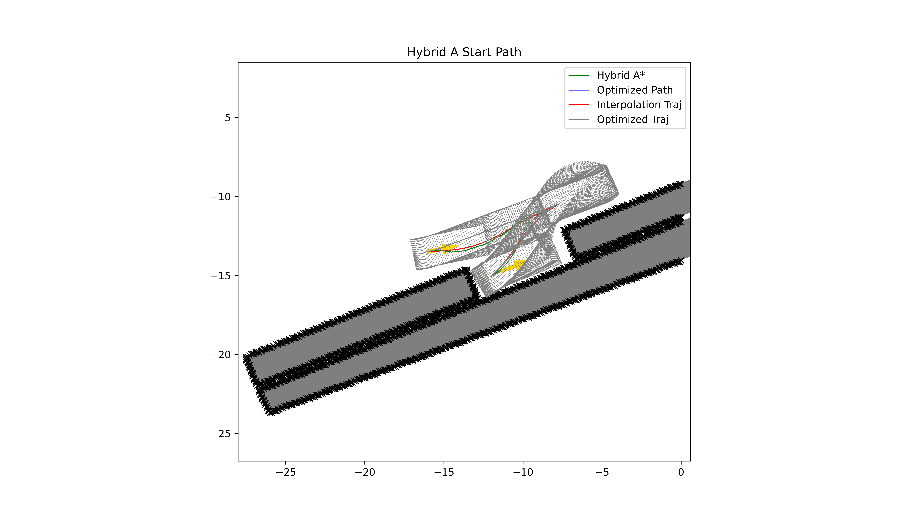

# Automated Valet Parking
## 1. Introduction
This repo provides an algorithm which uses hybrid a star for the initial path and the optimization based method to generate the trajectory. The pipeline of this algorithm is:

Hybrid A star -> Path optimization -> Cubic interpolation -> Velocity plan -> Solve optimization problem (use IPOPT)

---

### 1.1 File Structure
```
.
├── animation
│   ├── animation.py
│   └── record_solution.py
├── collision_check
│   └── collision_check.py
├── config
│   ├── config.yaml
│   └── read_config.py
├── interpolation
│   └── path_interpolation.py
├── main.py
├── map
│   └── costmap.py
├── optimization
│   ├── ipopt
│   ├── ocp_optimization.py
│   └── path_optimazition.py
├── path_planner
│   ├── compute_h.py
│   ├── hybrid_a_star.py
│   ├── path_planner.py
│   └── rs_curve.py
├── solution
│   └── Solution_Case1.csv
├── util_math
│   ├── coordinate_transform.py
│   └── spline.py
└── velocity_planner
    └── velocity_plan.py
```

### 1.2 Requirement
Python version >= 3.8
```
pip install -r requriements.txt

conda install -c conda-forge ipopt
```

### 1.3 Data Structure
The Case1.csv is provided by https://www.tpcap.net/#/benchmarks, and the details of this file are presented by the following:

>The first six rows of the vector record the initial and goal poses of the to-be-parked vehicle. Suppose $V$ is the data vector.
> - $x_{0}$ = $V$[ 1 ], $y_{0}$ = $V$[ 2 ], $\theta_{0}$ = $V$[ 3 ]
> - $x_{f}$ = $V$[ 4 ], $y_f$ = $V$[ 5 ], $\theta_f$ = $V$[ 6 ]. 
> - $V$[ 7 ] records the total number of obstacles in the parking scenario. 
> - $V$[ 7+$i$ ] presents the number of vertexes in the $i$-th obstacle, where the index $i$ ranges from 1 to $V$[7]. 
> - After that, the vertexes of each obstacle are presented by their 2D coordinate values in the $x$ and $y$ axes. 
---
**Note**: you can build your own parking map based on the above rules and store the .csv file in the BenchmarkCase folder.

## 2. Usage
run the main.py to show the animation process
```
python main.py
```

The solution of the trajectory is stored as a .csv file and its column name is `[x,y,theta,v,a,sigma,omega,t]`

The aniamation pictures including gif and png is stored in the pictures folder.




## 3. Todo List
 
- [ ] more spine function
- [ ] more velocity plan function