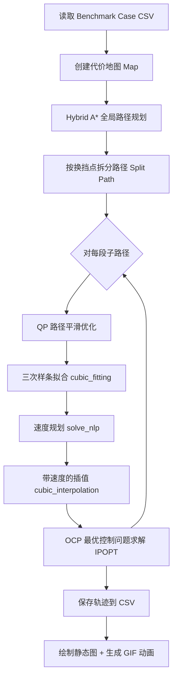

# Automated Valet Parking — 系统架构与模块设计文档

## 目录

1. [项目概述](#1-项目概述)
2. [整体流水线](#2-整体流水线)
3. [模块详细设计](#3-模块详细设计)
   - [3.1 config — 配置管理](#31-config--配置管理)
   - [3.2 map — 地图与车辆建模](#32-map--地图与车辆建模)
   - [3.3 path_plan — 路径规划 (Hybrid A*)](#33-path_plan--路径规划-hybrid-a)
   - [3.4 collision_check — 碰撞检测](#34-collision_check--碰撞检测)
   - [3.5 optimization — 路径优化](#35-optimization--路径优化)
   - [3.6 interpolation — 路径插值](#36-interpolation--路径插值)
   - [3.7 velocity_plan — 速度规划](#37-velocity_plan--速度规划)
   - [3.8 util_math — 数学工具](#38-util_math--数学工具)
   - [3.9 animation — 可视化与记录](#39-animation--可视化与记录)
   - [3.10 BenchmarkCases — 测试用例](#310-benchmarkcases--测试用例)
4. [数据流与关键数据结构](#4-数据流与关键数据结构)
5. [依赖项](#5-依赖项)

---

## 1. 项目概述

本项目实现了一个完整的**自动代客泊车（Automated Valet Parking）轨迹规划系统**，核心算法流程为：

```
Hybrid A* 全局路径规划 → 路径平滑优化 (QP) → 三次样条插值 → 速度规划 (NLP) → OCP 最优控制优化 (IPOPT)
```

项目由湖南大学 (HNU) wenqing-hnu 开发，地图数据格式参考了 Bai Li 的 [TPCAP_demo_Python](https://github.com/libai1943/TPCAP_demo_Python)。

---

## 2. 整体流水线

`main.py` 中的 `main()` 函数串联了整个处理流水线：



每一步的输出都作为下一步的输入，逐级精细化轨迹。

---

## 3. 模块详细设计

### 3.1 config — 配置管理

**文件**: `config/read_config.py`, `config/config.yaml`

#### 设计思路
使用 YAML 文件集中管理所有可调参数，通过 `read_config()` 函数一次性加载为字典，各模块通过字典键名访问参数，实现**配置与代码分离**。

#### 核心实现
```python
def read_config(config_name) -> dict:
    # 读取 config_name.yaml，返回字典
    with open(yaml_path) as f:
        config = yaml.load(f.read(), Loader=yaml.FullLoader)
    return config
```

#### 关键配置项

| 类别 | 参数 | 默认值 | 说明 |
|------|------|--------|------|
| **Hybrid A\*** | `steering_angle_num` | 5 | 转向角离散数，决定每层扩展节点数=2×5=10 |
| | `dt` | 0.6 s | 节点扩展时间步长 |
| | `flag_radius` | 18 m | RS曲线触发半径 |
| | `extended_num` | 1 | 子路径末端扩展点数 |
| **代价权重** | `cost_gear` | 1 | 换挡惩罚 |
| | `cost_heading_change` | 0.5 | 航向变化惩罚 |
| | `cost_scale` | 10 | 总代价缩放 |
| **碰撞检测** | `collision_check` | `distance` | 碰撞检测方法: `circle` 或 `distance` |
| | `safe_side_dis` | 0.1 m | 侧向安全裕度 |
| | `safe_fr_dis` | 0.1 m | 前后安全裕度 |
| **路径优化** | `smooth_cost` | 5 | 平滑项权重 |
| | `compact_cost` | 3 | 紧凑项权重 |
| | `offset_cost` | 0.8 | 偏离原始路径惩罚 |
| **速度规划** | `velocity_func_type` | `sin_func` | 速度函数类型 |
| | `velocity_plan_num` | 100 | 速度规划采样点数 |
| **OCP优化** | `cost_steering_angle` | 10 | 转向角代价 |
| | `cost_omega` | 10 | 转向角速度代价 |
| | `cost_acceleration` | 10 | 加速度代价 |
| | `cost_velocity` | 10 | 速度代价 |
| | `cost_time` | 100 | 时间代价 |

---

### 3.2 map — 地图与车辆建模

**文件**: `map/costmap.py`

#### 3.2.1 Vehicle 类

**职责**: 封装车辆几何参数与运动学约束。

**关键属性**:

| 属性 | 值 | 说明 |
|------|-----|------|
| `lw` | 2.8 m | 轴距 |
| `lf` | 0.96 m | 前悬长度 |
| `lr` | 0.929 m | 后悬长度 |
| `lb` | 1.942 m | 车宽 |
| `max_steering_angle` | 0.75 rad (≈43°) | 最大前轮转角 |
| `max_v` | 2.5 m/s | 最大速度 |
| `max_acc` | 1 m/s² | 最大加速度 |
| `max_angular_velocity` | 0.5 rad/s | 最大转向角速度 |
| `min_radius_turn` | lw/tan(max_steer) + lb/2 | 最小转弯半径 |

**关键方法**:

- **`create_polygon(x, y, theta)`**: 通过齐次坐标变换生成车辆矩形轮廓的 4 个顶点（逆时针顺序），用于可视化。

- **`create_anticlockpoint(x, y, theta, config)`**: 在 `create_polygon` 基础上**向外扩展**安全裕度（`safe_side_dis` + `safe_fr_dis`），生成膨胀后的 AABB 碰撞检测框。这是碰撞检测的核心几何基础。

**设计特点**:
- 车辆轮廓的生成使用了**旋转+平移的齐次变换矩阵**，将局部坐标下的车身点转换到全局坐标系。
- 膨胀框通过直接在局部坐标加减安全距离实现，避免了复杂的闵可夫斯基和运算。

#### 3.2.2 Case 类

**职责**: 解析 Benchmark CSV 文件，提取场景信息。

**CSV 格式**:
```
x0, y0, θ0, xf, yf, θf, obs_num, v1, v2, ..., vN, obs1_points..., obs2_points...
```
- 前 6 个值：起点位姿 (x, y, θ) + 终点位姿 (x, y, θ)
- `obs_num`：障碍物数量
- 后续：每个障碍物的顶点数和顶点坐标序列

**解析逻辑** (`Case.read(file)`):
1. 读取 CSV 第一行为浮点数列表
2. 提取起终点，计算地图边界（起终点 ±12 m）
3. 通过 `num_vertexes` 数组长度的累积和定位每个障碍物的顶点起始位置
4. 将顶点 reshape 为 `(nv, 2)` 的 numpy 数组

#### 3.2.3 Map 类

**职责**: 构建栅格代价地图，提供坐标与索引的相互转换。

**关键属性**:

| 属性 | 说明 |
|------|------|
| `discrete_size` | 栅格分辨率（默认 0.1 m） |
| `cost_map` | 代价数组，255=障碍物，0=自由空间 |
| `map_position` | `(x_position_array, y_position_array)`，网格坐标映射 |
| `boundary` | `[xmin, xmax, ymin, ymax]` 地图边界 |
| `grid_index_max` | 最大网格索引 = `nx × ny` |

**关键方法**:

- **`discrete_map()`**: 根据边界和分辨率创建 cost_map 零矩阵，生成 x/y 位置数组。

- **`detect_obstacle_edge()`** (当前使用): 仅检测障碍物的**边缘**像素，而非填充整个障碍物多边形。
  - 算法：对每个障碍物的每条边，通过旋转变换将边对齐到 x 轴，在边上等距采样点，将采样点映射回原始坐标并标记为障碍物。
  - 优点：减少标记的像素数，加速后续碰撞检测中的近邻搜索。

- **`detect_obstacle()`** (备选): 使用 Shapely 库的 `Polygon.intersects(Point)` 方法填充整个障碍物多边形区域。

- **`convert_position_to_index(grid_x, grid_y)`**: 将连续坐标转换为栅格的一维索引。

**设计特点**:
- 两种障碍物检测策略可供切换，边缘检测更高效但可能漏检非常规形状。
- 地图边界自动从起终点坐标扩展计算。

---

### 3.3 path_plan — 路径规划 (Hybrid A*)

本模块是系统的核心，包含四个文件：

#### 3.3.1 Node 类 (`hybrid_a_star.py`)

**职责**: 搜索树节点，存储状态与搜索信息。

```python
class Node:
    index: int            # 全局唯一索引
    x, y, theta: float    # 位姿 (x, y, 航向角)
    parent_index: int     # 父节点索引
    is_forward: bool      # 前进/后退
    steering_angle: float # 转向角
    g, h, f: float        # A* 代价: f = g + h
```

重载了 `__lt__` 运算符以支持 `PriorityQueue` 按 f 值排序。

#### 3.3.2 hybrid_a_star 类 (`hybrid_a_star.py`)

**职责**: Hybrid A* 搜索算法的核心实现。

**初始化流程**:
1. 离散转向角: `np.linspace(-max_steer, max_steer, N)`，生成 N 个可选转向角
2. 创建 Dijkstra 启发式对象，预计算目标点到各网格的距离
3. 初始化 open_list（PriorityQueue）和 closed_list
4. 创建起始节点和终止节点
5. 计算 `max_delta_heading`（最大单步航向变化量）

**节点扩展 (`expand_node`)**:
```
对于每个转向角 × 每个方向(前进/后退) = 2N 个子节点:
  1. 通过自行车运动学模型计算下一状态
     θ' = θ + (v_max × tan(δ) / lw) × dt
     x' = x + (v_max × dt) × cos(θ')
     y' = y + (v_max × dt) × sin(θ')
  2. 对轨迹进行离散化碰撞检测 (dt/ddt = 0.6/0.2 = 3 步)
  3. 计算 g(n) = 换挡惩罚 + 航向变化惩罚
  4. 计算 h(n) = max(Dijkstra(grid), RS曲线长度)
  5. 若节点已存在，比较 f 值并更新
  6. 加入 open_list
```

**启发式函数 (`calc_node_heuristic`)**:
- 采用 **max(Dijkstra 距离, RS 曲线长度)** 的混合策略
- Dijkstra 距离：通过栅格搜索得到从当前网格到目标的无障碍最短距离
- RS 曲线长度：考虑运动学约束的最短路径长度
- 取两者最大值保证了启发式的**可采纳性**（不会高估实际代价）

**RS 曲线尝试 (`try_reach_goal`)**:
- 当节点距目标的欧氏距离 < `flag_radius` (18 m) 时触发
- 计算从当前节点到目标的最优 RS 曲线
- 对整个 RS 路径进行碰撞检测
- 若无碰撞则搜索成功

**路径回溯 (`finish_path`)**:
- 从目标节点沿 parent_index 链回溯到起始节点
- 在每个节点对之间以 `ddt` 步长插入中间点，生成密集路径

#### 3.3.3 Dijkstra 类 (`compute_h.py`)

**职责**: 计算栅格图中各点到目标点的最短距离，作为启发式值。

**Grid 类**: 存储网格的 ID、坐标、距离和父节点 ID。

**搜索策略**:
- 以**目标点**为起点，Dijkstra 向外扩展
- 使用 8 邻域扩展（上下左右 + 四角），对角方向代价为 14，正交方向为 10
- 当扩展到当前节点所在网格时终止
- 返回距离值和闭列表（含所有已探索网格的距离信息）

**设计要点**:
- 使用 PriorityQueue 保证每次取距离最小的网格
- 保留闭列表以支持**增量式**启发式计算：若节点不在已计算的有效范围内，进行补充搜索
- 障碍物检测通过查询 `cost_map[x_index][y_index] == 255` 实现

#### 3.3.4 RS 曲线 (`rs_curve.py`)

**职责**: Reed-Shepp 曲线的生成。基于 [zhm-real/CurvesGenerator](https://github.com/zhm-real/CurvesGenerator) 实现。

**PATH 类**: 存储 RS 路径的长度、类型、离散点序列、航向角和方向信息。

**核心函数**:
- `calc_optimal_path()`: 计算所有 48 种 RS 曲线组合，返回总长度最短的路径
- `calc_all_paths()`: 生成所有可能的 RS 曲线类型并离散化
- 48 种路径类型包括: LSL, LSR, LRL, SCS 及其对称/反向组合

**辅助函数**: `pi_2_pi()` 将角度归一化到 `[-π, π]`。

#### 3.3.5 PathPlanner 类 (`path_planner.py`)

**职责**: 路径规划的协调层。

**路径分割 (`split_path`)**:
- 计算相邻三个点的方向向量余弦值
- 余弦值 < 0 时判定为**换挡点**（前进/后退切换）
- 在每个子路径末端**扩展节点**：沿当前航向以 `speed × ddt` 步长延伸，验证无碰撞后添加
- 扩展节点被同时记入前一段的末尾和下一段的开头，确保子路径间的**连续性**

**输出结构**:
```python
path_info = {
    'astar_path': [...],   # A* 搜索的部分路径
    'rs_path': PATH(...),  # RS 曲线对象
    'change_gear': int     # 换挡次数
}
```

---

### 3.4 collision_check — 碰撞检测

**文件**: `collision_check/collision_check.py`

#### 设计架构

采用**策略模式**，定义抽象基类 `collision_checker`，两种具体策略：

```
collision_checker (ABC)
├── two_circle_checker   # 双圆近似法
└── distance_checker     # 精确距离法
```

#### 3.4.1 抽象基类 `collision_checker`

**`get_near_obstacles(node_x, node_y, theta)`**:
1. 生成车辆膨胀多边形（含安全裕度）
2. 计算膨胀多边形的 AABB 包围盒
3. 从全局障碍物点集中筛选落入 AABB 的点
4. 返回附近障碍物坐标 + 车辆边界点

两步筛选策略（先 x 后 y）大幅减少需要精确检查的障碍物点数量。

#### 3.4.2 two_circle_checker

**原理**: 用两个等半径的圆覆盖车辆矩形轮廓。

- 圆直径 $R_d = \frac{1}{2}\sqrt{(\frac{lr+lw+lf}{2})^2 + lb^2}$
- 前圆心: $(x + \frac{1}{4}(3lw+3lf-lr)\cos\theta,\; y + \frac{1}{4}(3lw+3lf-lr)\sin\theta)$
- 后圆心: $(x + \frac{1}{4}(lw+lf-3lr)\cos\theta,\; y + \frac{1}{4}(lw+lf-3lr)\sin\theta)$

碰撞判定: 障碍物点到任一心距离 ≤ $R_d$

**优点**: 计算快速，适合搜索过程中的高频碰撞检测
**缺点**: 双圆不能完全覆盖车体矩形，存在**漏检区域**

#### 3.4.3 distance_checker

**原理**: 计算障碍物点到车辆四条边的精确距离。

**步骤**:
1. 计算四条边所在直线的 $k$（斜率）和 $b$（截距）
2. 对每个近邻障碍物点，计算其到四条直线的距离
3. 验证点是否在矩形内部：
   - `|dis2rl - dis2ll| < 车宽` 且 `|dis2fl - dis2bl| < 车长`
4. 额外检查角点和边上的点

**优点**: 精确，适合路径优化和最终验证
**缺点**: 计算量大

---

### 3.5 optimization — 路径优化

#### 3.5.1 路径平滑优化 (`path_optimazition.py`)

**`path_opti` 类** — 基于 QP (Quadratic Programming) 的路径平滑。

##### 问题建模

将子路径的 $n$ 个点展平为决策变量 $X = [x_1, y_1, x_2, y_2, \ldots, x_n, y_n]^T \in \mathbb{R}^{2n}$。

**目标函数** (三项加权和):

$$\min_X \quad w_{smooth} \cdot f_{smooth}(X) + w_{compact} \cdot f_{compact}(X) + w_{offset} \cdot f_{offset}(X)$$

- **平滑项 $f_{smooth}$**: $\sum_{i=2}^{n-1} \|x_{i-1} - 2x_i + x_{i+1}\|^2$，最小化相邻三点的二阶差分
- **紧凑项 $f_{compact}$**: $\sum_{i=1}^{n-1} \|x_{i+1} - x_i\|^2$，防止点过于分散
- **偏移项 $f_{offset}$**: $\sum_{i=1}^{n} \|x_i - x_i^{ref}\|^2$，保持接近原始路径

通过构造稀疏矩阵，将三项合并为标准 QP 形式:
$$\min_X \frac{1}{2} X^T P X + q^T X$$

**约束条件**:

1. **起终点固定**: $Ax = B$，其中 A 选取首尾两点的单位矩阵行
2. **碰撞约束**: $G_{coll} X \leq H_{coll}$，通过每个点的 AABB + 最近障碍物距离构建
3. **曲率约束**: $G_{curv} X \leq H_{curv}$，基于三点圆弧曲率近似

$$\kappa \approx \frac{\|(x_{i+1} - 2x_i + x_{i-1})\|}{\Delta s^2} \leq \kappa_{max}$$

使用**一阶泰勒展开**将非线性曲率约束线性化：
$$F'(X^r) X \leq F'(X^r) X^r - F(X^r)$$

**松弛变量**: 引入 `n-2` 个松弛变量处理碰撞和曲率约束的可行性问题，对应 H 矩阵中 999（宽松上界）或 0（紧下界）。

**求解器**: 使用 `cvxopt.solvers.qp` 求解。

**结果处理 (`get_result`)**:
- 从 QP 解中提取优化后的 `(x, y)`
- 根据原始路径的运动方向重新计算每个点的 $\theta$
- 判断 `forward` 标志（通过起点的 x 方向变化和航向角）

##### 碰撞边界计算 (`compute_collision_H`)

核心思想：对路径上每个点，计算车辆在四个方向（前/后/左/右）到最近障碍物的距离，转换为坐标的上下界约束 $[x_{min}, x_{max}, y_{min}, y_{max}]$。

根据车辆航向角 $\theta$ 划分四种情况（四个象限），每种情况下四个方向对应的 AABB 搜索区域不同，分别计算水平和垂直方向的安全距离。

#### 3.5.2 OCP 最优控制优化 (`ocp_optimization.py`)

**`ocp_optimization` 类** — 基于 IPOPT 的最优控制问题求解。

##### 决策变量

将 $n$ 个路径点的 7 个状态 + 终端时间展平为一个向量：
$$[x_1, y_1, \theta_1, v_1, a_1, \delta_1, \omega_1, \ldots, x_n, y_n, \theta_n, v_n, a_n, \delta_n, \omega_n, t_f]$$

共 $7n + 1$ 个变量。

##### 运动学约束 (自行车模型)

对相邻两点，以 `dt = tf / (n-1)` 为时间步长建立差分约束：

$$\begin{aligned}
x_{k+1} &= x_k + v_k \cdot dt \cdot (1 - \frac{1}{2}\delta_k^2) \\
y_{k+1} &= y_k + v_k \cdot dt \cdot (\delta_k - \frac{1}{6}\delta_k^3) \\
\theta_{k+1} &= \theta_k + v_k \cdot dt \cdot (\delta_k + \frac{1}{3}\delta_k^3) / L_w \\
v_{k+1} &= v_k + a_k \cdot dt \\
\delta_{k+1} &= \delta_k + \omega_k \cdot dt
\end{aligned}$$

> 注：使用 $\sin$ 和 $\cos$ 的泰勒展开近似以提高求解稳定性。

##### 目标函数

$$\min \quad w_t \cdot t_f + \sum_k (w_a \cdot a_k^2 + w_v \cdot v_k^2 + w_\delta \cdot \delta_k^2 + w_\omega \cdot \omega_k^2)$$

##### 边界约束

- 起终点位姿和速度固定（终端速度为 0）
- 每个点的 `(x, y)` 受碰撞边界约束 `[x_min, x_max, y_min, y_max]`
- 各状态量有物理上下界：$|\delta| \leq 0.75, |\omega| \leq 0.5, |a| \leq 1, |v| \leq 2.5$
- 初始速度设为 $[0, 10^{-4}]$ 小量以避免数值问题

##### 求解

使用 **Pyomo** 建模语言 + **IPOPT** 求解器（自带二进制文件 `optimization/ipopt`）。

初始解来自上一步插值路径，通过 `initial_x()` 函数对不可行初始值进行裁剪（clamp 到边界内）。

---

### 3.6 interpolation — 路径插值

**文件**: `interpolation/path_interpolation.py`

**`interpolation` 类** — 在平滑路径的基础上，结合速度函数生成时空轨迹。

#### 3.6.1 三次样条拟合 (`cubic_fitting`)

**流程**:
1. 遍历相邻路径点对
2. 调用 `spine.cubic_spline(start, end)` 进行坐标变换和三次曲线拟合
3. 通过 Simpson 积分计算每段弧长
4. 累加得到子路径总弧长

**返回值**:
```python
path_i_info = {
    'cubic_list': [func1, func2, ...],           # 每段的三次函数
    'rotation_matrix_list': [R1, R2, ...],       # 每段的旋转矩阵
    'arc_len_list': [l1, l2, ...],               # 每段弧长
    'new_end_list': [end1, end2, ...]            # 变换后终点坐标
}
```

#### 3.6.2 带速度的插值 (`cubic_interpolation`)

**核心思路**: 在每条三次样条曲线上，按等时间间隔 `dt` 插值，同时通过积分速度函数确定每个插值点的 x 坐标（弧长方向位置）。

**步骤**:
1. 设定时间步长 `dt = terminate_t / insert_num`
2. 对每个时间步，积分速度函数得到该步的弧长增量 $\Delta s$
3. 计算在变换坐标系中的新 x 坐标: `new_x = prev_x + direction × |Δs| × cos(prev_θ)`
4. 通过三次函数 $y = f(x)$ 计算对应的 y 和 $\theta$
5. 通过逆旋转变换将点映射回原始坐标系
6. 递归计算转向角: $\delta = \arctan(\frac{\Delta\theta \cdot L_w}{v \cdot \Delta t})$
7. 计算转向角速度: $\omega = \Delta\delta / \Delta t$

**自适应点数**: 根据弧长动态调整插值密度：
- 弧长 < 1 m → 25 点
- 1 m ≤ 弧长 ≤ 2 m → 50 点
- 弧长 > 2 m → 100 点 (默认)

**换挡点处理**: 换挡点处的速度、加速度强制设为 0。

**输出轨迹格式**: `[x, y, θ, v, a, δ, ω, t]` × N 个点。

---

### 3.7 velocity_plan — 速度规划

**文件**: `velocity_plan/velocity_planner.py`

#### 设计架构

采用**策略模式**，抽象基类 `velocity_func_base` 定义速度函数的接口：

```
velocity_func_base (ABC)
└── sin_func   # 正弦速度曲线
    (constant_func, double_s_func 预留给未来扩展)
```

#### 3.7.1 sin_func 速度函数

**速度曲线形状**:

$$v(t) = \begin{cases}
A \sin(Wt), & 0 \leq t < t_0 \\
A, & t_0 \leq t < t_0 + t_1 \\
A \sin(W(t - t_1)), & t_0 + t_1 \leq t \leq t_f
\end{cases}$$

其中 $t_0 = \frac{\pi}{2W}$, $t_f = t_1 + \frac{\pi}{W}$

```mermaid
graph LR
    subgraph 速度曲线
    A[加速段<br/>Asin(Wt)] --> B[匀速段<br/>A]
    B --> C[减速段<br/>Asin(W(t-t1))]
    end
```

曲线呈现**加速→匀速→减速**的对称梯形剖面。

#### 3.7.2 VelocityPlanner 类

**`solve_nlp(arc_length)`**:
- 决策变量: $[t_1, A, W]$
- 目标函数: $\min \; t_f = t_1 + \frac{\pi}{W}$
- 约束条件:
  - $t_1 > 0, A > 0, W > 0$
  - $A \leq v_{max}$ (速度上限)
  - $A \cdot W \leq a_{max}$ (加速度上限)
  - $t_1 \cdot A + 2A/W = L_{arc}$ (弧长约束，保证总行驶距离匹配)
- 求解器: `scipy.optimize.minimize` + SLSQP 方法

**输出**: 速度-加速度函数 `v_a_func(t)` 和终止时间 `terminate_t`。

---

### 3.8 util_math — 数学工具

#### 3.8.1 三次样条 (`spline.py`)

**`spine` 类** (所有方法为静态方法):

**`cubic_spline(start, end)`**:
1. 以 `start` 点为原点进行二维旋转变换
2. 变换后 `start` 点为 $(0, 0, 0)$，`end` 点为 $(x_1, y_1, \theta_1)$
3. 解线性方程组求三次曲线系数:

$$\begin{bmatrix}
0 & 0 & 0 & 1 \\
x_1^3 & x_1^2 & x_1 & 1 \\
0 & 0 & 1 & 0 \\
3x_1^2 & 2x_1 & 1 & 0
\end{bmatrix}
\begin{bmatrix} a \\ b \\ c \\ d \end{bmatrix} =
\begin{bmatrix} y_0 \\ y_1 \\ \tan\theta_0 \\ \tan\theta_1 \end{bmatrix}$$

4. 返回三次函数 $y = ax^3 + bx^2 + cx + d$、旋转矩阵和新终点坐标

**`Simpson_integral(func, start, end)`**: 使用 Simpson 法则数值积分计算弧长。

#### 3.8.2 坐标变换 (`coordinate_transform.py`)

**`coordinate_transform` 类** (所有方法为静态方法):

**`twodim_transform(start, end)`**:
- 以 start 航向角构建旋转矩阵 $R = \begin{bmatrix} \cos\theta & \sin\theta \\ -\sin\theta & \cos\theta \end{bmatrix}$
- 计算变换后的终点: $p' = R(p_{end} - p_{start})$, $\theta' = \theta_{end} - \theta_{start}$

**`inverse_trans(trans_path, rotation_matrix, start)`**:
- 逆变换: $p = R^T \cdot p' + p_{start}$
- 航向角: $\theta = \theta' + \theta_{start}$

---

### 3.9 animation — 可视化与记录

#### 3.9.1 动画绘制 (`animation.py`)

**`ploter` 类** (所有方法为静态方法):

| 方法 | 功能 |
|------|------|
| `plot_obstacles(map)` | 绘制障碍物多边形 + 起点(绿)/终点(红)车辆轮廓 + 方向箭头 |
| `plot_final_path(path, color, show_car, label)` | 逐点绘制路径并用车辆矩形示意 |
| `plot_collision_p(x, y, theta, map)` | 可视化碰撞位置（含双圆） |
| `save_gif(path, save_gif_name, map)` | 生成逐帧 GIF 动画（使用 `matplotlib.animation.ArtistAnimation`） |

#### 3.9.2 曲线绘制 (`curve_plot.py`)

**`CurvePloter` 类**:

`plot_curve(data_save_path, data_save_name, save_fig_path)`:
- 读取优化前后的轨迹 CSV 文件
- 分别绘制 v-t, a-t, σ-t, ω-t 四条对比曲线
- 蓝色 = OCP 优化后，红色 = OCP 优化前

#### 3.9.3 数据记录 (`record_solution.py`)

**`DataRecorder` 类**:

`record(save_path, save_name, trajectory)`:
- 验证轨迹点包含 8 个元素: `[x, y, θ, v, a, σ, ω, t]`
- 使用 pandas 保存为 TSV 文件（`\t` 分隔）
- 自动添加 `Solution_` 前缀

---

### 3.10 BenchmarkCases — 测试用例

**文件**: `BenchmarkCases/Case1.csv` ~ `Case20.csv`, `RunMe.py`

每个 CSV 文件定义一个泊车场景，包含：
- 起点位姿 (x, y, θ)
- 终点位姿 (x, y, θ)
- 障碍物多边形（支持凹/凸多边形）

`RunMe.py` 提供场景预览功能，绘制所有 Case 的地图布局（障碍物 + 起终点车辆）。

---

## 4. 数据流与关键数据结构

### 4.1 路径点格式演变

| 阶段 | 格式 | 说明 |
|------|------|------|
| Hybrid A* 输出 | `[x, y, θ]` | 仅位姿 |
| QP 优化后 | `[x, y, θ]` | 坐标被平滑 |
| 插值后 | `[x, y, θ, v, a, δ, ω, t]` | 8 维时空轨迹 |
| OCP 优化后 | `[x, y, θ, v, a, δ, ω, t]` | 8 维最优轨迹 |

### 4.2 路径分割与组装

```
原始路径 → split_path() → [segment1, segment2, ...]
          ↓
每个 segment 独立进行: QP优化 → 样条拟合 → 速度规划 → 插值 → OCP
          ↓
所有 segment 结果 → extend() → 完整轨迹
```

### 4.3 坐标变换链

在插值阶段，为了简化三次样条拟合，采用了坐标变换流水线：

```
原始坐标 (global)
    ↓ twodim_transform (以start为新原点旋转)
变换坐标 (local, start=(0,0,0))
    ↓ cubic_spline 拟合
变换坐标中的插值点
    ↓ inverse_trans (逆旋转+平移)
原始坐标 (global) 中的插值点
```

---

## 5. 依赖项

| 包名 | 版本 | 用途 |
|------|------|------|
| `numpy` | 1.22.0 | 数值计算基础库 |
| `scipy` | 1.7.3 | 空间距离、优化求解 (SLSQP)、积分 |
| `matplotlib` | 3.5.0 | 可视化与动画 |
| `pandas` | 1.3.5 | CSV 读写 |
| `PyYAML` | 6.0 | YAML 配置解析 |
| `cvxopt` | 1.2.7 | 二次规划 (QP) 求解 |
| `Pyomo` | 6.4.2 | 数学优化建模语言 |
| `Shapely` | 1.8.2 | 几何多边形操作（备选障碍物填充） |
| IPOPT | (自带二进制) | 非线性规划求解器 |

---

*文档生成日期: 2026-07-24*
